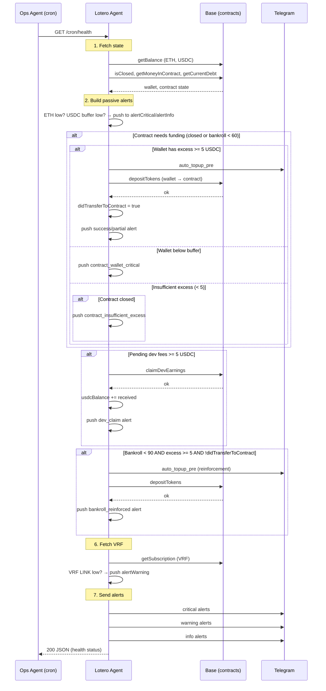
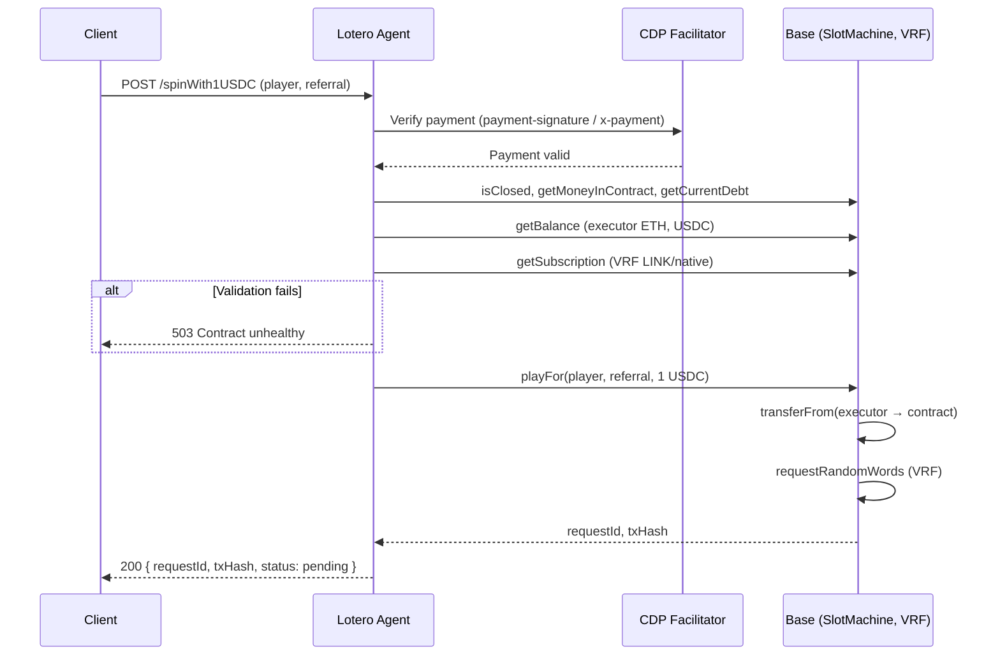
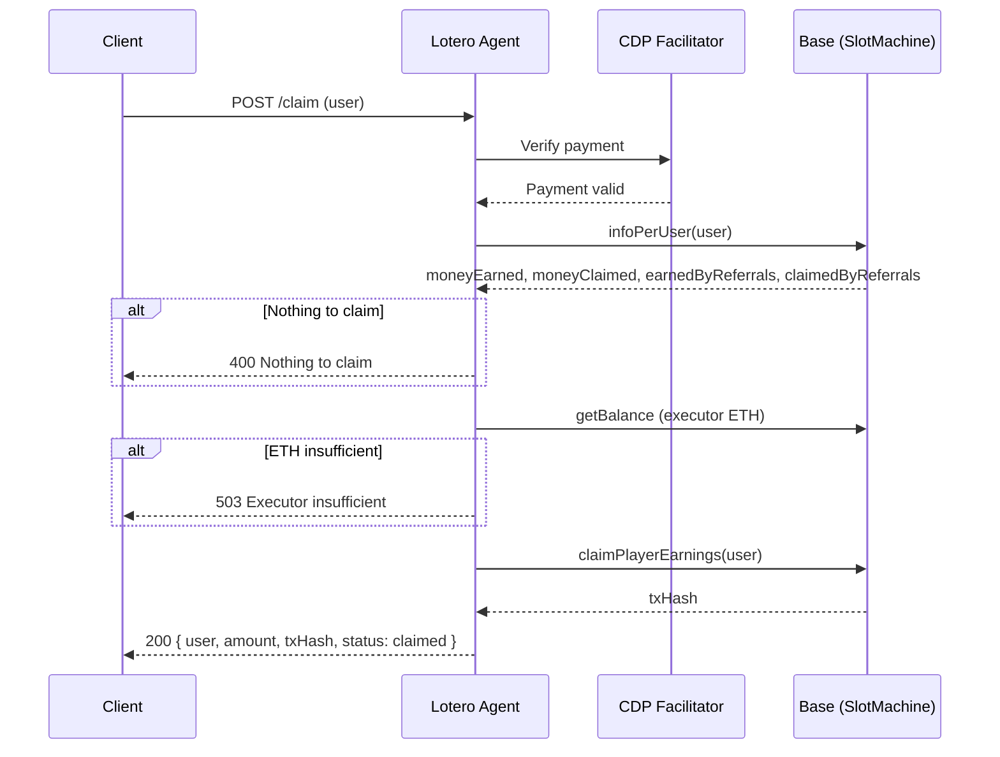

# Lotero Agent – Flow Documentation

Detailed sequence diagrams and explanations for each agent flow. The [agent README](../packages/agent/README.md) has the high-level overview.

---

## 1. Cron health flow (`GET /cron/health`)

Called by the **Ops Agent** (external cron) every few minutes. Returns system status and may execute on-chain actions.

### Sequence diagram

### Steps summary

| Step | Action |
|------|--------|
| 1 | Fetch wallet (ETH, USDC) and contract (bankroll, debt, isClosed) |
| 2 | Build passive alerts (ETH low → CRITICAL, USDC buffer low → INFO) |
| 3 | **Contract needs funding**: if closed or bankroll < 60, and excess ≥ 5, transfer to contract (max 1 per run) |
| 4 | **Dev claim**: if pending ≥ 5 USDC, claim to wallet |
| 5 | **Wallet excess → contract**: if bankroll < 90, excess ≥ 5, and step 3 did not transfer, reinforce |
| 6 | Fetch VRF subscription, build LINK low alert |
| 7 | Send Telegram alerts: critical → warning → info |

### Key rules

- **One transfer per run**: Step 5 is skipped if step 3 already transferred.
- **Min excess 5 USDC**: No transfer if excess < 5 (avoids micro-transactions).
- **contract_insufficient_excess** alert: Only when contract is CLOSED. When open, no alert (auto top-up will run when excess arrives).

---

## 2. Spin flow (`POST /spinWith1USDC`)

Client pays 1.05 USDC via x402. Executor pays 1 USDC on-chain and gas.

### Sequence diagram

### Pre-spin validations

- Contract open (`!isClosed`)
- Available bankroll ≥ 30 USDC
- Executor ETH ≥ 0.001
- Executor USDC ≥ 1
- VRF subscription balance sufficient (if configured)

---

## 3. Claim flow (`POST /claim`)

Client pays 0.5 USDC via x402. Executor pays gas.

### Sequence diagram

---

## Constants reference

See [packages/agent/src/utils/constants.js](../packages/agent/src/utils/constants.js) for thresholds:

| Constant | Value | Used in |
|----------|-------|---------|
| CONTRACT_MIN_AVAILABLE_BANKROLL_USDC | 30 | Spin validation |
| CONTRACT_TOPUP_TRIGGER_BANKROLL_USDC | 60 | Cron step 3 |
| CONTRACT_TARGET_BANKROLL_USDC | 90 | Cron transfers capped at this |
| WALLET_EXCESS_MIN_FOR_CONTRACT_USDC | 5 | Cron steps 3 & 5 |
| EXECUTOR_MIN_USDC_FOR_SPIN | 1 | Spin validation |
