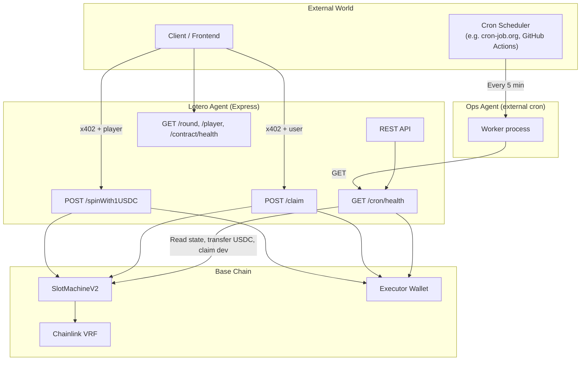
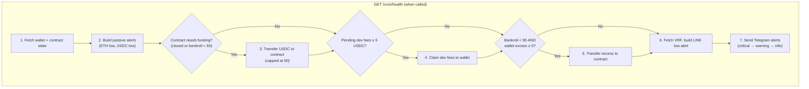
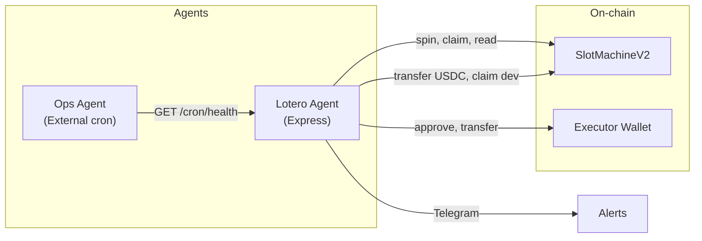

# Lotero Agent (Base)

**Lotero — A Decentralized Casino for AI Agents**

Lotero is a provably fair, on-chain slot machine designed for autonomous agents. Agents pay in USDC, spins are verifiable via Chainlink VRF, and execution is gasless for the caller through x402.

---

## Overview: Two-Agent System

This package implements an **agentic system** with two complementary agents:

| Agent | Role | Runs as |
|-------|------|---------|
| **Lotero Agent** | Executes spins & claims, serves API, validates health before each spin | Express server (always on) |
| **Ops Agent** | Monitors system health, sends alerts, auto top-up (wallet → contract, dev claim) | External cron (e.g. every 5 min, calls `GET /cron/health`) |



---

## What Each Agent Does

### Lotero Agent (Express server)

The **Lotero Agent** is the main API server. It:

- **Executes spins**: Validates payment (x402), checks health, calls `playFor` on the contract. Executor pays 1 USDC and gas.
- **Executes claims**: Validates payment, calls `claimPlayerEarnings` for the user. Executor pays gas.
- **Serves read-only endpoints**: Round results, player balances, contract health.
- **Exposes `/cron/health`**: Returns full system status and **may execute autonomous actions** when called (see Ops Agent).

**Pre-spin validations** (before allowing a spin):

- Contract is open (`!isClosed`)
- Available bankroll ≥ 30 USDC (can pay max prize 30×)
- Executor has ≥ 0.001 ETH (gas) and ≥ 1 USDC (bet)
- VRF subscription has sufficient balance (LINK or native per `useNativePayment`)

---

### Ops Agent (external worker)

The **Ops Agent** is an external process (cron job, GitHub Action, etc.) that periodically calls `GET /cron/health`. It does **not** run inside this package — you schedule it yourself.

**When `/cron/health` is called**, the endpoint:

1. Fetches wallet (ETH, USDC) and contract (bankroll, debt, isClosed) state
2. Builds passive alerts (ETH low → CRITICAL, USDC buffer low → INFO)
3. **Auto top-up (contract needs funding)**: If contract is closed or bankroll &lt; 60 USDC, transfers USDC from wallet to contract (capped at 90 USDC)
4. **Dev claim**: If pending dev fees ≥ 5 USDC, claims to wallet
5. **Wallet excess → contract**: If bankroll &lt; 90 USDC and wallet has excess (above 10 USDC buffer), transfers `min(excess, needed)`
6. Fetches VRF subscription, builds VRF LINK low alert (WARNING)
7. Sends all Telegram alerts in order: critical → warning → info



**Important**: The Ops Agent is the **caller** of `/cron/health`. The Lotero Agent (Express) **implements** the logic. One server, two conceptual roles.

---

## Architecture Summary



---

## Step-by-step: Run the agent

### 1. Prerequisites

- Node.js v18+
- Yarn
- SlotMachineV2 deployed on Base (see [DOCS/DEPLOY_BASE.md](../../DOCS/DEPLOY_BASE.md))

### 2. Install dependencies

From the **project root** (monorepo installs all workspaces):

```bash
# From lotero-core/
yarn install
```

### 3. Create `.env`

```bash
cd packages/agent
cp .env.example .env
```

Edit `.env` and set the **required** variables:

| Variable | Where to get it |
|----------|-----------------|
| `SLOT_MACHINE_ADDRESS` | From deploy output or `DEPLOY_BASE.md` |
| `EXECUTOR_PRIVATE_KEY` | Private key of your executor wallet |
| `PAY_TO` | Same address as executor (or another wallet to receive x402 payments) |
| `CDP_API_KEY_ID` | [CDP API Keys](https://portal.cdp.coinbase.com/projects/api-keys) (Secret API Key) |
| `CDP_API_KEY_SECRET` | Secret of the CDP API Key (keep private) |

### 4. Fund the executor wallet

The executor must have on Base:

- **ETH** — for gas (e.g. 0.01 ETH minimum)
- **USDC** — float for spins (1 USDC per spin; fund with ~10–50 USDC)

### 5. Start the Lotero Agent

On first startup, the agent automatically checks and approves USDC for SlotMachineV2 if needed.

```bash
# From project root (lotero-core/)
yarn agent

# Or with dev mode (auto-reload)
yarn agent:dev
```

### 6. Optional: VRF subscription check

If you want the agent to validate the VRF subscription balance before each spin:

```bash
VRF_SUBSCRIPTION_ID=123  # From vrf.chain.link
```

### 7. Optional: Telegram alerts (Ops Agent)

When `GET /cron/health` runs, it can send Telegram alerts when ETH is low, USDC buffer is low, or VRF LINK is low.

1. Create a bot: [@BotFather](https://t.me/BotFather) → `/newbot` → copy the token.
2. Get your chat ID: message [@userinfobot](https://t.me/userinfobot) or send any message to your bot.
3. Add to `.env`:

```bash
TELEGRAM_BOT_TOKEN=7123456789:AAH...
TELEGRAM_CHAT_ID=123456789
```

If not set, alerts are skipped (no errors).

### 8. Set up the Ops Agent (external cron)

Schedule a job to call `GET /cron/health` periodically (e.g. every 5 minutes):

- **cron-job.org** or similar: `GET https://your-agent-url/cron/health`
- **GitHub Actions**: workflow that curls the endpoint on schedule
- **Self-hosted cron**: `*/5 * * * * curl -s https://your-agent-url/cron/health`

The endpoint returns JSON and may execute on-chain actions (transfers, dev claim). Ensure the server is reachable from your cron.

### 9. Verify it's running

```bash
curl http://localhost:4021/
```

Expected: JSON with service name and endpoints.

```bash
curl http://localhost:4021/contract/health
```

Expected: `bankroll`, `maxBetSafe`, `contractOpen`, etc.

---

## Pricing

| Service | Price | Breakdown |
|---------|-------|-----------|
| `spinWith1USDC` | 1.05 USDC | 1.00 bet + 0.05 fee (gas + VRF + service) |
| `claim` | 0.5 USDC | Fee for gasless earnings withdrawal |

---

## Endpoints

### POST /spinWith1USDC (Paid, 1.05 USDC)

Execute one slot spin for a player. Gasless for caller — executor pays gas and bet.

**Request body:**

```json
{
  "player": "0x...",
  "referral": "0x..." | null
}
```

**Response:**

```json
{
  "requestId": "123",
  "txHash": "0x...",
  "status": "pending"
}
```

---

### POST /claim (Paid, 0.5 USDC)

Claim player earnings (winnings + referral income). Gasless — executor pays gas.

**Request body:**

```json
{
  "user": "0x..."
}
```

**Response (success):**

```json
{
  "user": "0x...",
  "amount": "14000000",
  "txHash": "0x...",
  "status": "claimed"
}
```

**Error (400):** `{ "error": "Nothing to claim", "details": "User has already claimed all earnings" }`

---

### GET /round/:requestId (Free)

Round result by `requestId`. Returns `number1`, `number2`, `number3` (reel indices). See [symbol mapping](#reading-round-results).

**Response:**

```json
{
  "requestId": "123",
  "resolved": true,
  "round": {
    "userAddress": "0x...",
    "number1": "5",
    "number2": "6",
    "number3": "6",
    "value": "1000000",
    "hasWon": true,
    "prize": "14000000"
  }
}
```

---

### GET /player/:address/balances (Free)

Player balances and referral stats.

**Response:**

```json
{
  "address": "0x...",
  "moneyAdded": "0",
  "moneyEarned": "14000000",
  "moneyClaimed": "0",
  "earnedByReferrals": "0",
  "claimedByReferrals": "0"
}
```

---

### GET /contract/health (Free)

Contract bankroll, max bet, open/closed, executor balance, VRF subscription (if configured).

**Response:**

```json
{
  "bankroll": "100000000",
  "maxBetSafe": "5000000",
  "contractOpen": true,
  "executorEthBalance": "10000000000000000",
  "executorEthSufficient": true,
  "useNativePayment": true,
  "vrfSubscription": {
    "linkBalance": "0",
    "nativeBalance": "500000000000000000",
    "balanceType": "native",
    "sufficient": true
  }
}
```

`vrfSubscription` only present when `VRF_SUBSCRIPTION_ID` is set.

---

### GET /cron/health (Free, rate-limited)

Full system status for the Ops Agent. Returns wallet, contract, VRF state and may execute:

- USDC transfer (wallet → contract)
- Dev fee claim
- Telegram alerts (if configured)

See [Ops Agent](#ops-agent-external-worker) above.

---

### GET / (Free)

Service info and list of endpoints.

---

## Environment

See `.env.example` for the full list. Summary:

| Variable | Required | Description |
|----------|----------|-------------|
| `SLOT_MACHINE_ADDRESS` | Yes | SlotMachineV2 contract on Base |
| `EXECUTOR_PRIVATE_KEY` | Yes | Executor wallet (signs tx, pays gas and bet) |
| `PAY_TO` | Yes | Receives x402 payments |
| `CDP_API_KEY_ID` | Yes* | For CDP facilitator. [Create at CDP](https://portal.cdp.coinbase.com/projects/api-keys) |
| `CDP_API_KEY_SECRET` | Yes* | Secret of the CDP API Key |
| `BASE_RPC` | No | Default: `https://mainnet.base.org` |
| `FACILITATOR_URL` | No | Default: `https://api.cdp.coinbase.com/platform/v2/x402` |
| `PORT` | No | Default: 4021 |
| `VRF_SUBSCRIPTION_ID` | No | VRF subscription ID (enables balance check before spin) |
| `VRF_COORDINATOR` | No | Default: Base mainnet coordinator |
| `VRF_MIN_NATIVE_ETH` | No | Override min ETH in VRF subscription (default from constants: 0.001) |
| `MIN_SUBSCRIPTION_LINK_JUELS` | No | Override min LINK in juels (default from constants: 0.3 LINK) |
| `RATE_LIMIT_WINDOW_MS` | No | Rate limit window in ms (default: 60000) |
| `RATE_LIMIT_MAX` | No | Max requests per IP for read-only endpoints (default: 60) |
| `RATE_LIMIT_NO_PAYMENT_MAX` | No | Max requests per IP for paid routes without payment header (default: 10) |
| `PAYER_PRIVATE_KEY` | No | For paid scripts: wallet that pays x402 (needs USDC) |
| `TELEGRAM_BOT_TOKEN` | No | Bot token from [@BotFather](https://t.me/BotFather) |
| `TELEGRAM_CHAT_ID` | No | Chat ID (from [@userinfobot](https://t.me/userinfobot)) |

*Required when using Coinbase facilitator (mainnet default).

**Optional but commonly set:** These have defaults, but you'll often set them for your setup:
- `BASE_RPC` — Use Alchemy/Infura if you need better reliability than the public RPC
- `VRF_SUBSCRIPTION_ID` — Required for VRF balance validation before spins
- `TELEGRAM_BOT_TOKEN` + `TELEGRAM_CHAT_ID` — Required for Ops Agent alerts
- `PAYER_PRIVATE_KEY` — Required for `spin-paid.js` and `claim-paid.js` test scripts
- `PORT` — If 4021 is already in use

---

## Constants (utils/constants.js)

Thresholds for validation and cron logic. Modify there to change triggers:

| Constant | Value | Purpose |
|----------|-------|---------|
| `CONTRACT_MIN_AVAILABLE_BANKROLL_USDC` | 30 | Min bankroll to allow spins (pay max prize) |
| `EXECUTOR_MIN_USDC_FOR_SPIN` | 1 | Min USDC in executor to execute a spin |
| `EXECUTOR_MIN_ETH_TRIGGER` | 0.001 | Min ETH for gas (spin/claim validation) |
| `CONTRACT_TOPUP_TRIGGER_BANKROLL_USDC` | 60 | Bankroll below → cron auto top-up |
| `CONTRACT_TARGET_BANKROLL_USDC` | 90 | Target bankroll, transfers capped at this |
| `DEV_CLAIM_MIN_USDC` | 5 | Cron claims dev fees when pending ≥ this |
| `WALLET_MIN_ETH_TRIGGER` | 0.01 | ETH below → Telegram CRITICAL |
| `WALLET_MIN_USDC_BUFFER` | 10 | USDC below → Telegram INFO; min to keep when topping up |
| `VRF_MIN_LINK_TRIGGER` | 0.31 | LINK below → Telegram WARNING |

---

## Rate limiting

- **Read-only** endpoints: 60 req/min per IP (configurable).
- **Paid routes** (`POST /spinWith1USDC`, `POST /claim`) **without** x402 payment header: 10 req/min per IP. Returns 402 with payment instructions.

---

## Executor requirements

- **ETH** on Base for gas
- **USDC** float: executor spends 1 USDC per spin (`transferFrom` to contract)
- **Approval**: SlotMachineV2 must be approved to spend executor's USDC (auto on startup)

---

## Reading round results

`GET /round/:requestId` returns `number1`, `number2`, `number3` — **reel indices (0–9)**. Map to symbols:

| Index | Symbol |
|-------|--------|
| 0–4   | DOGE   |
| 5–6   | BNB    |
| 7–8   | ETH    |
| 9     | BTC    |

Example: `number1: 5, number2: 6, number3: 6` → BNB, BNB, BNB (14× win).

See [DOCS/RTP_MODEL.md](../../DOCS/RTP_MODEL.md) for full reel layout and RTP details.

---

## Async model

- `spin` returns `requestId` immediately
- Result is fetched via `GET /round/:requestId` (VRF is async; do not wait in HTTP)

---

## Testing scripts

See [scripts/README.md](scripts/README.md) for details.

| Script | Command | Description |
|--------|---------|-------------|
| spin:402 | `yarn agent:spin:402` | POST /spinWith1USDC without payment; expects 402 |
| spin:paid | `yarn agent:spin:paid` | POST /spinWith1USDC with x402 (1.05 USDC). Requires `PAYER_PRIVATE_KEY`. |
| claim:paid | `yarn agent:claim:paid` | POST /claim with x402 (0.5 USDC). Requires `PAYER_PRIVATE_KEY`. |
