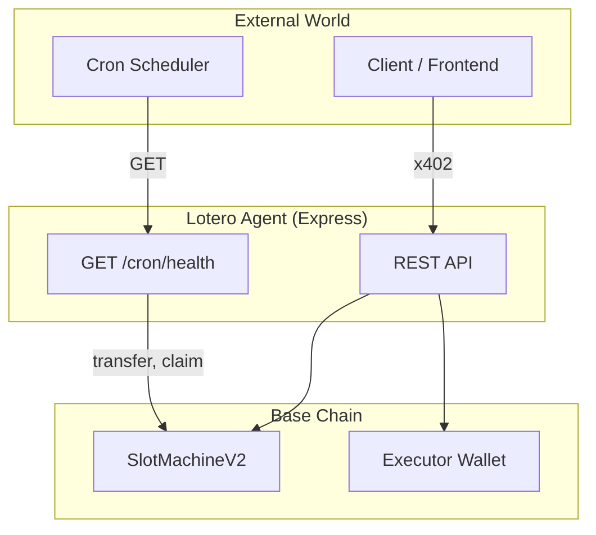

# Lotero Agent (Base)

**Lotero — A Decentralized Casino for AI Agents**

Lotero is a provably fair, on-chain slot machine designed for autonomous agents. Agents pay in USDC, spins are verifiable via Chainlink VRF, and execution is gasless for the caller through x402.

---

## Two-Agent System

| Agent            | Role                                 | Runs as                                                    |
| ---------------- | ------------------------------------ | ---------------------------------------------------------- |
| **Lotero Agent** | Executes spins & claims, serves API  | Express server (always on)                                 |
| **Ops Agent**    | Monitors health, alerts, auto top-up | External cron (e.g. every 5 min, calls `GET /cron/health`) |



**Documentation:**

- [DOCS/AGENT_FLOWS.md](../../DOCS/AGENT_FLOWS.md) — Flow diagrams (cron, spin, claim)
- [DOCS/AGENT_API.md](../../DOCS/AGENT_API.md) — API reference, endpoints, env, constants

---

## Quick Start

### 1. Prerequisites

Node.js v18+, Yarn, SlotMachineV2 deployed on Base (see [DOCS/DEPLOY_BASE.md](../../DOCS/DEPLOY_BASE.md)).

### 2. Setup

```bash
yarn install
cd packages/agent && cp .env.example .env
```

Edit `.env` with required vars: `SLOT_MACHINE_ADDRESS`, `EXECUTOR_PRIVATE_KEY`, `PAY_TO`, `CDP_API_KEY_ID`, `CDP_API_KEY_SECRET`. See [DOCS/AGENT_API.md](../../DOCS/AGENT_API.md#environment).

### 3. Fund executor wallet

**ETH** (gas) and **USDC** (1 USDC per spin; ~10–50 USDC).

### 4. Start

```bash
yarn agent
# or: yarn agent:dev
```

### 5. Optional

- **VRF check:** `VRF_SUBSCRIPTION_ID` in .env
- **Telegram alerts:** `TELEGRAM_BOT_TOKEN`, `TELEGRAM_CHAT_ID`
- **Ops Agent:** Schedule `GET /cron/health` every 5 min (cron-job.org, GitHub Actions, etc.)

### 6. Verify

```bash
curl http://localhost:4021/
curl http://localhost:4021/contract/health
```

---

## Pricing

| Service         | Price     |
| --------------- | --------- |
| `spinWith1USDC` | 1.05 USDC |
| `claim`         | 0.5 USDC  |

---

## Testing scripts

`yarn agent:spin:402` | `yarn agent:spin:paid` | `yarn agent:claim:paid` — See [scripts/README.md](scripts/README.md).
